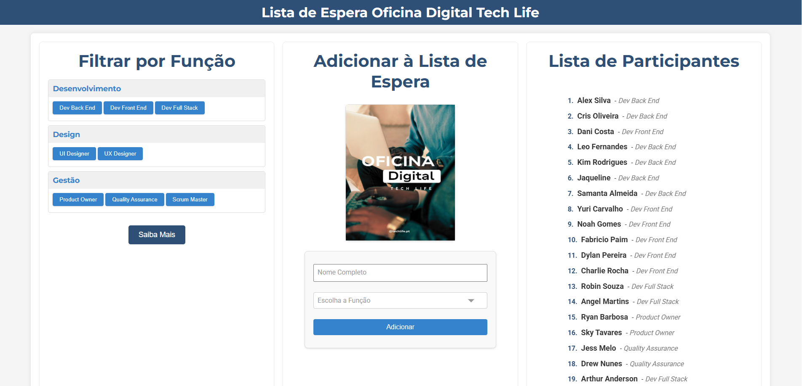

# 🚀 Oficina Digital Tech Life – Lista de Espera

  
  
  
  
  
  
  
  

# ✨ Funcionalidades
- ✅ Inscrição de Participantes: Adicione nome completo e função desejada.
- 📋 Listagem de Inscritos: Visualize todos os participantes da lista.
- 🎯 Filtro por Função: Encontre participantes por cargo (ex: Dev Back End, UI Designer).
- ✏️ Edição de Dados: Atualize informações (somente admins).
- 🗑️ Exclusão de Participantes: Remova participantes (somente admins).
- 🔐 Login de Administrador: Protege ações críticas via autenticação com JWT.
- 📄 Página Saiba Mais: Redirecionamento para informações extras.
- 🔔 Notificações com Toastify.js: Feedback visual de sucesso ou erro.

# 🛠️ Tecnologias Utilizadas
- Frontend
* HTML5 + CSS3
* JavaScript (Vanilla JS)
* Toastify.js – notificações
* Font Awesome – ícones

- Backend (Serverless via Vercel)
* Node.js
* MongoDB Driver
* bcrypt – hashing de senhas
* jsonwebtoken (JWT) – autenticação
* dotenv – variáveis de ambiente
* Banco de Dados
* MongoDB Atlas

# ⚙️ Pré-requisitos
- Node.js 18.x ou superior
- npm ou Yarn
- Vercel CLI (opcional, mas recomendado)
- Conta no MongoDB Atlas

# 🚀 Instalação Local
- bash
- Copiar
- Editar
- git clone https://github.com/seu-usuario/nome-do-repositorio.git
- cd nome-do-repositorio
- npm install
- 💡 Se o package.json estiver em api/, navegue até lá antes de rodar o npm install.

# 📡 Endpoints da API
- Todos os endpoints começam com /api.

## 📸 Captura de Tela

## 🧑‍💻 Autor

Desenvolvido com 💙 por <strong>Sílvia Avelar</strong>

&nbsp;&nbsp;

Entre em contato ou veja outros projetos!

